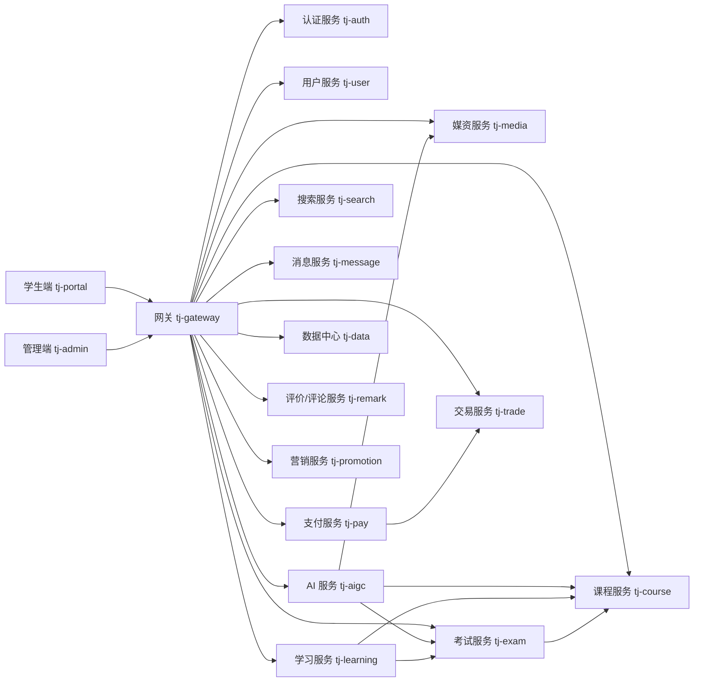

# LearnHub

LearnHub是一套面向在线教育场景的前后端分离、微服务化在线学习平台。项目覆盖课程管理、媒资管理、在线学习、考试练习、订单支付、运营管理等基础业务，并在此基础上集成 AI 对话、AI 出题、视频智能处理、知识库检索、主观题智能评估等智能教学能力。

项目同时提供：

- **学生端（tj-portal）**：面向学生和普通用户，提供课程浏览、课程学习、视频播放、阶段练习、考试、笔记、错题、AI 学习辅助和订单支付等功能。
- **管理端（tj-admin）**：面向管理员、教师和运营人员，提供用户、教师、课程、目录、媒资、题库、试卷、AI 教学工作台和业务运营管理功能。
- **微服务后端**：按照业务领域拆分为认证、用户、课程、媒资、学习、考试、支付、交易、搜索、消息、AI 等服务，通过网关统一对外提供接口

---

## 目录

- [一、项目概览](#一项目概览)
- [二、核心功能](#二核心功能)
- [三、系统架构](#三系统架构)
- [四、项目结构](#四项目结构)
- [五、技术栈](#五技术栈)
- [六、运行环境](#六运行环境)
- [七、基础设施](#七基础设施)
- [八、快速开始](#八快速开始)
- [九、配置说明](#九配置说明)
- [十、前端开发](#十前端开发)
- [十一、后端开发与构建](#十一后端开发与构建)
- [十二、接口文档](#十二接口文档)
- [十三、生产部署](#十三生产部署)
- [十四、AI 能力配置](#十四ai-能力配置)
- [十五、常见问题](#十五常见问题)

---

## 一、项目概览

### 1.1 项目定位

LearnHub以在线课程和职业技能学习为核心，面向“课程内容生产—课程发布—学生学习—练习考试—学习反馈”的完整教学闭环进行设计。

项目将传统在线教育能力与生成式 AI 能力结合：

```text
课程与媒资
    ↓
视频转写、内容分析、知识点提取
    ↓
AI 对话、AI 出题、测验草稿
    ↓
教师审核、确认、发布
    ↓
学生练习、答题、判分、错题复习
```

### 1.2 用户角色

| 角色 | 主要职责 |
|---|---|
| 学生/普通用户 | 浏览课程、购买课程、学习课程、完成练习考试、记录笔记、使用 AI 学习辅助 |
| 教师 | 创建和维护课程、上传媒资、配置课程目录、管理题目和阶段测验、使用 AI 教学工具 |
| 管理员 | 管理用户与教师、审核课程和内容、维护题库、处理运营和系统管理事务 |
| 系统服务 | 负责认证、业务处理、异步任务、消息通知、搜索、支付和 AI 能力调用 |

---

## 二、核心功能

### 2.1 学生端功能

- 用户注册、登录、退出和个人资料管理；
- 首页推荐、课程列表、课程搜索和课程详情；
- 课程购买、订单查询、支付和课程报名；
- 课程目录浏览和视频学习；
- 学习进度记录和继续学习；
- 阶段练习、章节测试和考试；
- 客观题自动判分；
- 主观题提交及智能评估能力；
- 笔记、收藏、评论和学习记录；
- 错题查看、错题重做和复习记录；
- AI 学习对话、课程内容问答和学习辅助；
- 个人订单、优惠券、积分和消息等个人中心功能。

### 2.2 管理端功能

- 用户、教师、角色、菜单和权限管理；
- 课程创建、编辑、上下架和课程信息维护；
- 课程章节、小节、练习和阶段考试目录管理；
- 视频、图片、文档等媒资管理；
- 题型、题目、答案、解析和知识点维护；
- 试卷、练习、题目发布和题目审核；
- AI 教学工作台；
- AI 出题批次创建、草稿审核、题目确认和发布；
- 视频 AI 转写、摘要、知识点和复习重点生成；
- 根据视频分析结果生成小节测验或章节综合测验草稿；
- 知识库文档处理、向量检索和基于课程资料的 AI 问答；
- 订单、支付、优惠券、营销和消息管理；
- 数据统计和运营管理。

### 2.3 AI 能力

项目中的 AI 能力按业务场景划分，彼此使用独立配置，避免把普通聊天模型和语音模型混用：

| 能力 | 说明 |
|---|---|
| AI 对话 | 面向学生和教师提供连续对话、课程问答和文本创作辅助 |
| AI 出题 | 根据课程内容、知识点、题型和难度生成题目草稿 |
| 视频 AI | 对课程视频进行语音转写、内容分析、摘要、知识点和复习重点提取 |
| AI 测验 | 根据视频分析结果生成小节测验或章节综合测验草稿 |
| 知识库/RAG | 对课程资料建立向量索引，并基于检索结果回答问题 |
| 主观题评估 | 根据题目、参考答案、评分点和学生答案辅助完成主观题评估 |

---

## 三、系统架构

### 3.1 逻辑架构



### 3.2 服务间通信

- 浏览器请求统一进入网关；
- 网关负责路由、登录态解析和用户身份透传；
- 微服务之间通过 Spring Cloud OpenFeign 调用；
- Nacos 提供服务注册发现和集中配置；
- RabbitMQ 用于支付通知、异步业务事件和跨服务消息；
- Redis 用于缓存、登录态、分布式锁和部分异步任务辅助状态；
- Seata 用于需要跨服务协调的事务场景；
- XXL-JOB 用于定时任务和调度管理；
- Elasticsearch 用于搜索相关能力；
- MySQL 按业务服务划分数据库或数据表。

---

## 四、项目结构

```text
tjxt-ai-完整版-sy-AI拓展版/
├── pom.xml                         # Maven 根工程
├── startup.sh                      # 后端镜像与容器启动脚本
├── Dockerfile                      # 后端基础镜像定义
│
├── tj-common/                      # 公共组件、异常、工具、统一响应等
├── tj-api/                         # 服务间调用 API、DTO 和接口模型
├── tj-auth/                        # 认证、登录、权限和 Token 相关服务
│   ├── tj-auth-common/
│   ├── tj-auth-gateway-sdk/
│   ├── tj-auth-resource-sdk/
│   └── tj-auth-service/
├── tj-gateway/                     # API 网关
├── tj-user/                        # 用户和教师相关业务
├── tj-message/                     # 消息、通知和站内信
│   ├── tj-message-api/
│   ├── tj-message-domain/
│   └── tj-message-service/
├── tj-media/                       # 媒资、视频和文件管理
├── tj-course/                      # 课程、章节、小节和课程目录
├── tj-search/                      # 搜索服务
├── tj-learning/                    # 学习记录、学习进度和学习行为
├── tj-exam/                        # 题库、练习、考试、判分和错题
├── tj-pay/                         # 支付服务
│   ├── tj-pay-api/
│   ├── tj-pay-domain/
│   └── tj-pay-service/
├── tj-trade/                       # 交易订单和课程交易业务
├── tj-promotion/                   # 优惠券、营销和促销业务
├── tj-data/                        # 数据中心和统计相关业务
├── tj-remark/                      # 评论、评价和互动内容
├── tj-aigc/                        # AI 对话、出题、视频 AI、RAG 等能力
│
├── tj-portal/                      # 学生端 Vue 3 前端
└── tj-admin/                       # 管理端 Vue 3 前端
```

### 4.1 后端模块职责

| 模块 | 职责 |
|---|---|
| `tj-common` | 公共异常、工具类、统一响应、MyBatis 和 Web 公共配置 |
| `tj-api` | 服务间共享的接口定义、DTO、VO 和 Feign 相关模型 |
| `tj-auth` | 登录认证、Token、权限资源和网关认证支持 |
| `tj-gateway` | 统一入口、路由、鉴权和请求转发 |
| `tj-user` | 用户、教师及用户扩展信息 |
| `tj-course` | 课程、目录、章节、小节和发布状态 |
| `tj-media` | 媒资上传、文件信息、视频和媒资状态 |
| `tj-learning` | 学习记录、学习进度、学习行为和课程学习数据 |
| `tj-exam` | 题目、题库、练习、考试、判分和错题 |
| `tj-pay` | 支付单、支付渠道、支付通知和退款相关能力 |
| `tj-trade` | 业务订单、订单明细和课程购买关系 |
| `tj-search` | 课程及相关内容检索 |
| `tj-message` | 消息、通知和站内信 |
| `tj-promotion` | 优惠券和营销活动 |
| `tj-data` | 数据中心及统计分析 |
| `tj-remark` | 评论、评价和互动内容 |
| `tj-aigc` | AI 对话、AI 出题、视频智能处理、知识库和智能评估 |

---

## 五、技术栈

### 5.1 后端

- Java 17；
- Spring Boot 3.3.5；
- Spring Cloud 2023.0.3；
- Spring Cloud Alibaba 2023.0.3.2；
- Spring AI 1.0.0；
- MyBatis-Plus 3.5.9；
- Lombok；
- OpenFeign；
- Springdoc OpenAPI；
- MySQL Connector/J；
- Redis、Redisson；
- RabbitMQ；
- Nacos；
- Seata；
- XXL-JOB；
- Elasticsearch 7.x；
- Docker。

### 5.2 前端

- Vue 3；
- Vite 2；
- Vue Router；
- Pinia；
- Element Plus；
- Axios；
- Sass；
- ECharts；
- Markdown 渲染和代码高亮；
- 腾讯云点播/播放器相关 SDK；
- 浏览器端音视频处理和录音相关 SDK。

### 5.3 云服务和第三方能力

项目可根据部署环境接入以下能力：

- 阿里云 DashScope：聊天模型和语音转写模型；
- 阿里云 OSS：AI 处理过程中的文件存储；
- 腾讯云 COS/VOD：媒资和视频相关能力；
- 微信支付、支付宝或其他支付渠道；
- RabbitMQ：消息队列；
- Elasticsearch：搜索和检索；
- Nacos：服务治理和配置中心。

---

## 六、运行环境

### 6.1 推荐版本

| 软件 | 推荐版本 |
|---|---|
| JDK | 17 |
| Maven | 3.8 或更高版本 |
| Node.js | 17 或 18 |
| npm | 8 或更高版本 |
| MySQL | 8.0 |
| Redis | 6 或更高版本 |
| RabbitMQ | 3.10 或更高版本 |
| Nacos | 2.x |
| Elasticsearch | 7.x |
| Docker | 20.10 或更高版本 |

项目后端源码和 Maven 配置使用 UTF-8 编码，前端页面也应使用 UTF-8 保存，避免中文内容出现乱码。

### 6.2 开发机准备

安装以下工具：

1. JDK 17，并配置 `JAVA_HOME`；
2. Maven，并确认 `mvn -v` 可以正常执行；
3. Node.js 和 npm，并确认 `node -v`、`npm -v` 可以正常执行；
4. Git；
5. Docker Desktop 或 Linux Docker 环境；
6. 可访问的 MySQL、Redis、RabbitMQ、Nacos、Elasticsearch 实例。

---

## 七、基础设施

后端服务启动前，需要先准备基础设施。基础设施可以运行在本机、Docker Compose、测试服务器或云环境中。

| 基础设施 | 用途 |
|---|---|
| MySQL | 保存用户、课程、媒资、学习、考试、订单和 AI 业务数据 |
| Redis | 缓存、登录态、分布式锁及短期状态 |
| RabbitMQ | 异步消息和跨服务事件通知 |
| Nacos | 配置中心和服务注册中心 |
| Elasticsearch | 搜索索引和检索 |
| Seata | 分布式事务协调 |
| XXL-JOB | 定时任务调度 |
| OSS/COS/VOD | 文件、视频和音视频媒资存储 |

基础设施启动顺序建议如下：

```text
MySQL / Redis / RabbitMQ / Elasticsearch
                ↓
Nacos / Seata / XXL-JOB
                ↓
认证服务和网关
                ↓
业务微服务
                ↓
AI 服务
                ↓
学生端和管理端前端
```

> 不要把数据库密码、Token、AccessKey、Secret、支付私钥或模型 API Key 写入 Git 仓库、README 或前端代码。

---

## 八、快速开始

### 8.1 获取项目

```bash
git clone <项目仓库地址>
cd tjxt-ai-完整版-sy-AI拓展版
```

### 8.2 配置基础设施

先启动 MySQL、Redis、RabbitMQ、Nacos、Elasticsearch 等依赖，并在 Nacos 中创建项目所需的服务配置。

至少需要确认：

- Nacos 地址、命名空间和分组正确；
- 每个服务的数据库连接正确；
- Redis 地址和密码正确；
- RabbitMQ 地址、端口、用户名和密码正确；
- 服务注册名与网关路由一致；
- 文件存储配置可用；
- AI 模型和第三方服务凭证已经配置；
- 需要支付功能时，支付商户配置完整。

### 8.3 构建后端

在项目根目录执行：

```bash
mvn clean package -DskipTests
```

执行完整测试：

```bash
mvn test
```

只构建某个服务及其依赖，例如构建 AI 服务：

```bash
mvn -pl tj-aigc -am package -DskipTests
```

### 8.4 启动后端服务

本地开发时可以使用 IDE 启动各服务的 `*Application` 启动类，也可以使用 Spring Boot Maven 插件：

```bash
mvn -pl tj-gateway -am spring-boot:run
mvn -pl tj-aigc -am spring-boot:run
```

不同服务应根据实际依赖顺序启动。服务启动后，先检查 Nacos 中是否出现对应实例，再访问网关接口。

### 8.5 启动学生端

```bash
cd tj-portal
npm install
npm run dev
```

默认开发端口：

```text
http://localhost:18082
```

### 8.6 启动管理端

```bash
cd tj-admin
npm install
npm run dev
```

默认开发端口：

```text
http://localhost:18081
```

开发端前端请求地址由对应的 `src/config/proxy.js` 和 Vite 配置控制。首次启动前应确认请求地址指向当前网关或 API 域名。

---

## 九、配置说明

### 9.1 Nacos 配置

项目使用 Nacos 进行服务注册和配置管理。常见配置可按照以下方式组织：

```text
shared-spring.yaml       # Spring 基础配置
shared-redis.yaml        # Redis 配置
shared-mybatis.yaml      # MyBatis 配置
shared-feign.yaml        # Feign 配置
shared-logs.yaml         # 日志配置
<service-name>.yaml      # 对应业务服务配置
```

服务通常需要读取：

- `spring.application.name`；
- Nacos 服务发现和配置中心地址；
- Nacos namespace、group 和用户名密码；
- 数据源；
- Redis；
- RabbitMQ；
- 日志；
- Feign；
- 第三方云服务；
- AI 模型；
- 文件存储；
- 支付渠道。

实际部署时应以当前环境的 Nacos 配置为准，不建议把生产配置复制到源码目录中。

### 9.2 网关和前端接口地址

前端通过网关访问后端。生产环境建议使用同源反向代理：

```text
浏览器
  → https://业务域名/api
  → Nginx 或网关
  → tj-gateway:10010
  → 具体业务服务
```

开发环境可以直接将前端代理到网关地址，但生产环境不要把内部服务地址暴露给浏览器。

### 9.3 数据库

每个业务服务的数据表应使用对应的业务数据库或明确的数据表前缀。初始化数据库时应：

1. 创建数据库并设置 `utf8mb4` 字符集；
2. 导入基础表结构和初始化数据；
3. 按版本顺序执行数据库迁移脚本；
4. 检查 JSON、TEXT、LONGTEXT 等字段类型是否符合业务需要；
5. 确认服务账号仅拥有必要权限；
6. 生产环境执行迁移前完成备份。

### 9.4 文件和媒资

视频、音频、图片和文档通常只在数据库中保存元数据，实际文件保存在对象存储或视频服务中。媒资配置应至少包含：

- 存储服务类型；
- Bucket 或空间名称；
- 地域；
- 访问域名；
- 上传凭证或服务端密钥；
- 临时访问地址有效期；
- 文件大小和时长限制。

视频 AI 处理要求媒资状态可用，且服务端能够访问对应视频地址。对于没有文件扩展名但 URL 包含扩展名的媒资，服务端应根据实际部署版本的格式识别逻辑处理。

---

## 十、前端开发

### 10.1 学生端 `tj-portal`

```bash
cd tj-portal
npm install
npm run dev          # 开发模式
npm run dev:test     # 测试环境开发模式
npm run dev:pro      # 生产接口开发模式
npm run build        # 开发环境构建
npm run build:test   # 测试环境构建
npm run build:prod   # 生产环境构建
npm run preview      # 本地预览构建结果
```

主要目录：

```text
tj-portal/
├── public/           # 公共静态资源
├── src/
│   ├── api/          # 接口请求
│   ├── assets/       # 图片、字体等资源
│   ├── components/   # 公共组件
│   ├── config/       # 环境和请求配置
│   ├── pages/        # 页面
│   ├── router/       # 路由
│   ├── store/        # Pinia 状态
│   ├── style/        # 全局样式
│   └── utils/        # 请求封装和工具函数
├── package.json
└── vite.config.js
```

### 10.2 管理端 `tj-admin`

```bash
cd tj-admin
npm install
npm run dev          # 开发模式
npm run dev:test     # 测试环境开发模式
npm run dev:prod     # 生产接口开发模式
npm run build        # 开发环境构建
npm run build:test   # 测试环境构建
npm run build:prod   # 生产环境构建
npm run preview      # 本地预览构建结果
```

主要目录：

```text
tj-admin/
├── public/           # 公共静态资源
├── src/
│   ├── api/          # 接口请求
│   ├── assets/       # 图片和资源
│   ├── components/   # 公共组件
│   ├── config/       # 环境和请求配置
│   ├── pages/        # 管理页面
│   ├── router/       # 路由
│   ├── store/        # Pinia 状态
│   ├── style/        # 全局样式
│   └── utils/        # 工具函数
├── package.json
└── vite.config.js
```

### 10.3 前端开发注意事项

- 页面中文、中文注释和用户提示使用正常 UTF-8 中文，不要改写成 `\uXXXX` 字符编码；
- 修改接口路径时要同时检查网关路由和后端 Controller 路径；
- 修改学生端功能时要检查 `tj-portal`，修改管理端功能时要检查 `tj-admin`；
- 两端共享同一业务能力时，应保持接口字段、状态枚举和错误提示的一致性；
- AI 请求通常耗时较长，页面应提供加载状态、错误提示、取消或重试能力；
- 生产构建后应使用浏览器强制刷新，避免旧资源缓存导致页面和接口版本不一致。

---

## 十一、后端开发与构建

### 11.1 常用 Maven 命令

```bash
# 编译全部模块
mvn compile

# 跳过测试打包
mvn clean package -DskipTests

# 执行全部测试
mvn test

# 构建指定服务及其依赖
mvn -pl tj-course -am package -DskipTests
mvn -pl tj-exam -am package -DskipTests
mvn -pl tj-aigc -am package -DskipTests

# 只编译指定服务
mvn -pl tj-aigc -am compile

# 清理构建产物
mvn clean
```

### 11.2 服务启动类

| 服务 | 启动类 | 默认端口 |
|---|---|---:|
| `tj-auth` | `com.tianji.AuthApplication` | 8081 |
| `tj-user` | `com.tianji.UserApplication` | 8082 |
| `tj-search` | `com.tianji.SearchApplication` | 8083 |
| `tj-media` | `com.tianji.MediaApplication` | 8084 |
| `tj-message` | `com.tianji.MessageApplication` | 8085 |
| `tj-course` | `com.tianji.CourseApplication` | 8086 |
| `tj-pay` | `com.tianji.PayApplication` | 8087 |
| `tj-trade` | `com.tianji.TradeApplication` | 8088 |
| `tj-exam` | `com.tianji.ExamApplication` | 8089 |
| `tj-learning` | `com.tianji.LearningApplication` | 8090 |
| `tj-remark` | `com.tianji.RemarkApplication` | 8091 |
| `tj-promotion` | `com.tianji.PromotionApplication` | 8092 |
| `tj-data` | `com.tianji.DataCenterApplication` | 8093 |
| `tj-aigc` | `com.tianji.AIGCApplication` | 8094 |
| `tj-gateway` | `com.tianji.GatewayApplication` | 10010 |

> 端口以部署环境 Nacos 配置和启动参数为准。服务间调用应优先使用服务发现，不要在业务代码中硬编码服务器 IP。

---

## 十二、接口文档

后端服务集成 Springdoc OpenAPI，服务启动后通常可以访问：

```text
http://localhost:<服务端口>/v3/api-docs
```

例如：

```text
http://localhost:8094/v3/api-docs
```

实际浏览器访问路径可能经过网关路由，具体以网关配置为准。

常见接口分组包括：

- 认证和账号接口；
- 用户和教师接口；
- 课程和目录接口；
- 媒资接口；
- 学习记录接口；
- 题目、练习、考试和错题接口；
- 订单、支付和交易接口；
- AI 对话、出题、视频处理和知识库接口。

所有需要登录的接口都应携带有效登录态。直接访问业务服务端口时，也必须遵循服务本身的认证和权限规则。

---

## 十三、生产部署

### 13.1 推荐部署拓扑

```text
Nginx
├── 学生端静态资源
├── 管理端静态资源
└── /api → tj-gateway:10010
                 ├── 认证和用户服务
                 ├── 课程、媒资和学习服务
                 ├── 考试、支付和交易服务
                 └── AI 服务
```

### 13.2 后端部署

推荐流程：

1. 在构建机执行 Maven 编译、测试和打包；
2. 将对应服务 JAR 交给 CI/CD 流水线；
3. 构建 Docker 镜像；
4. 使用服务对应端口启动容器；
5. 将容器加入服务网络；
6. 检查 Nacos 注册状态和服务日志；
7. 执行接口健康检查和关键业务冒烟测试；
8. 确认无误后再切换流量。

项目根目录的 `startup.sh` 可用于按服务复制 JAR、构建镜像和启动容器。生产环境使用时，应根据实际流水线、目录和权限配置调整参数，不要直接把开发机路径写入生产脚本。

### 13.3 前端部署

两端前端分别构建，不要只部署其中一个：

```bash
cd tj-portal
npm ci
npm run build:prod

cd ../tj-admin
npm ci
npm run build:prod
```

构建产物分别位于：

```text
tj-portal/dist/
tj-admin/dist/
```

发布时建议：

1. 为每次发布生成独立版本目录；
2. 将构建产物上传到新目录；
3. 校验静态资源完整性；
4. 以原子方式切换 Nginx 当前版本软链接或发布目录；
5. 同时检查学生端和管理端首页；
6. 检查 `/api` 请求是否指向正确网关；
7. 强制刷新浏览器并验证登录、课程、AI 页面；
8. 保留上一个稳定版本，便于快速回滚。

后端代码由项目的代码仓库和 CI/CD 流程统一构建部署；前端发布时必须同步考虑学生端和管理端，避免只更新一端导致接口或页面版本不一致。

---

## 十四、AI 能力配置

### 14.1 模型配置原则

项目中的模型配置应按能力隔离：

```text
tj.ai.chat       # 普通聊天、文本生成和对话模型
tj.ai.audio      # TTS/STT 和语音转写模型
tj.ai.video      # 视频处理业务策略和结果版本
```

普通文本和聊天请求使用聊天模型；语音转写请求使用语音模型。不要为了让语音转写生效而把全局聊天模型改成语音转写模型。

### 14.2 视频 AI 语音转写

视频 AI 当前使用独立的语音转写配置，典型配置结构如下：

```yaml
tj:
  ai:
    audio:
      type: DASHSCOPE
      transcription-model: paraformer-v2
    video:
      provider: audio-service
      provider-version: v1
      config-version: video-ai-v1
      language: zh
```

上述配置中：

- `tj.ai.audio.type` 表示语音服务类型；
- `tj.ai.audio.transcription-model` 表示语音转写模型；
- `paraformer-v2` 只用于语音转写，不替代普通聊天模型；
- `tj.ai.video.provider` 表示视频处理所使用的转写服务抽象；
- `config-version` 用于标识视频处理配置版本和结果版本。

实际 API Key、AccessKey、Secret、OSS 配置和模型额度应通过 Nacos、环境变量或密钥管理系统注入。

### 14.3 视频 AI 处理链路

```text
管理端创建视频任务
    ↓
校验课程、小节和媒资归属
    ↓
获取视频地址并下载临时文件
    ↓
上传 AI 处理所需的对象存储
    ↓
语音转写
    ↓
生成视频简介、核心内容、分段摘要、知识点和复习重点
    ↓
保存结构化分析结果
    ↓
生成小节或章节测验草稿
    ↓
教师审核、确认和发布
```

### 14.4 AI 使用注意事项

- 生产环境必须配置有效的模型凭证和调用额度；
- 外部模型调用应设置超时、重试次数和失败原因；
- 长视频应关注文件大小、视频时长、临时文件和容器磁盘空间；
- 模型输出必须进行 JSON、字段、长度和业务内容校验；
- 转写为空或分析结果无效时，不应生成看似正常的摘要或测验；
- AI 生成的题目在发布前应由教师审核；
- 课程资料和学生答案可能包含敏感信息，应遵守数据最小化原则；
- 不要在日志中输出完整提示词中的隐私内容、完整 Token 或第三方密钥。

---

## 十五、常见问题

### 15.1 服务启动后注册不到 Nacos

检查：

1. Nacos 服务是否启动；
2. Nacos 地址、端口、namespace 和 group 是否正确；
3. 容器是否与 Nacos 位于可互通网络；
4. 服务名是否与配置中心 Data ID 和网关路由一致；
5. Nacos 用户名和密码是否正确；
6. 查看服务启动日志中的注册失败原因。

### 15.2 接口返回 401

通常表示请求没有携带有效登录态，或 Token 已过期。请检查：

- 是否已经登录；
- 浏览器是否保存了正确 Token；
- 网关是否正确透传认证信息；
- 服务端时间是否一致；
- 是否访问了需要登录的业务接口。

不要为了绕过 401 而删除后端权限校验。

### 15.3 前端页面打开但接口失败

检查：

- `src/config/proxy.js` 中的接口地址；
- Vite 当前构建模式；
- Nginx `/api` 反向代理；
- 网关路由；
- 浏览器 Network 面板中的实际请求 URL；
- 对应后端服务和 Nacos 实例状态。

### 15.4 AI 请求失败或长时间没有结果

检查：

- DashScope 或其他模型凭证是否有效；
- 账户是否有可用额度；
- Nacos 中模型配置是否被正确读取；
- 请求内容是否超过模型限制；
- `tj-aigc`、对象存储和 RabbitMQ 是否正常；
- 任务状态、失败原因和重试次数；
- 容器磁盘是否被临时视频文件占满。

### 15.5 视频无法转写

优先检查：

1. 媒资状态是否为可用状态；
2. 课程、小节和媒资是否属于同一课程关系；
3. 视频 URL 是否可从 `tj-aigc` 容器访问；
4. 临时授权地址是否过期；
5. 视频格式和扩展名是否能被识别；
6. 语音转写模型是否配置为语音模型；
7. OSS 上传配置是否正确；
8. 任务失败原因是否为下载、上传、转写或分析阶段。

### 15.6 生产前端更新后页面仍是旧版本

可能是浏览器或 CDN 缓存。建议：

- 使用带版本号的发布目录；
- 原子切换静态资源目录；
- 清理或刷新 CDN 缓存；
- 浏览器执行强制刷新；
- 检查 `index.html` 引用的 JS/CSS 哈希文件是否为新版本。

### 15.7 支付服务启动失败

支付服务可能依赖支付商户证书、私钥、平台证书和回调配置。应检查：

- 商户号、应用 ID 和证书配置；
- 私钥和平台证书是否有效；
- 证书路径或密钥内容是否正确；
- 服务器时间是否准确；
- 支付服务是否能访问微信支付或支付宝服务；
- 测试支付和真实支付配置是否明确隔离。

真实支付代码和测试支付逻辑必须分别管理，不能用测试逻辑替代生产真实支付。
